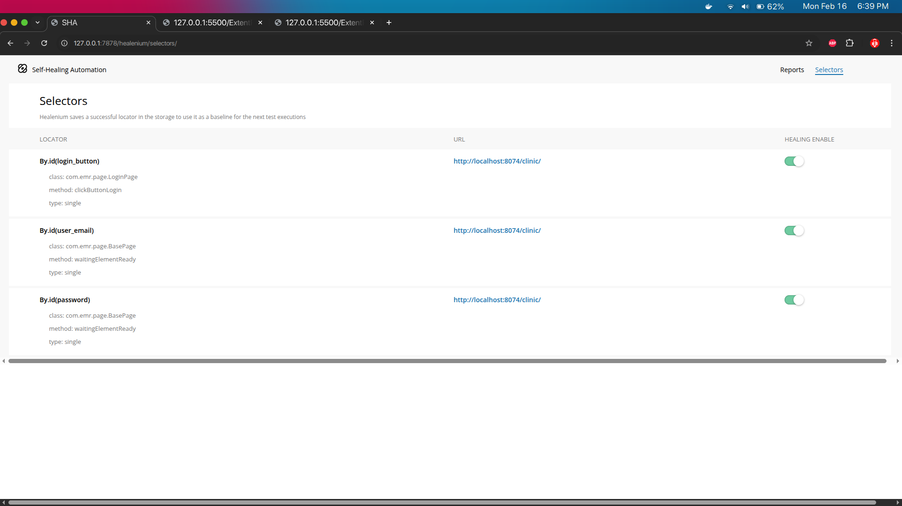

# EMR Test Healenium

Ini adalah proyek pengujian otomatis UI untuk sistem Electronic Medical Record (EMR) yang memanfaatkan beberapa teknologi modern untuk pengujian yang efisien dan Andal.

## Tentang Proyek Ini

Proyek ini adalah kerangka kerja pengujian otomatis UI yang dikembangkan dengan Java dan Maven. Ini menggunakan Selenium WebDriver untuk interaksi browser, Cucumber untuk pengembangan berbasis perilaku (BDD) yang memungkinkan penulisan skenario pengujian yang mudah dibaca, dan Healenium untuk kemampuan _self-healing_ elemen. Kemampuan _self-healing_ Healenium sangat penting untuk mengurangi kegagalan pengujian akibat perubahan kecil pada locator elemen UI. Fokus utamanya adalah pengujian otomatis, khususnya fungsionalitas login, untuk sistem EMR. Proyek ini juga mengintegrasikan Extent Reports untuk pelaporan hasil pengujian yang komprehensif.

## Struktur Proyek

```
.
├── .git/
├── .gitignore
├── .vscode/
├── Dokumentasi/
│   ├── Demo Healenium Selenium.mp4
│   ├── Report Healing.png
│   ├── Report Selectors.png
│   └── Script testing.png
├── ExtentReports/
├── pom.xml
├── docker-compose.yaml
├── src/
│   ├── main/
│   │   └── java/
│   │       └── com/
│   │           └── emr/
│   │               └── App.java
│   └── test/
│       ├── java/
│       │   └── com/
│       │       └── emr/
│       │           ├── AppTest.java
│       │           ├── definition/
│   	│           │   └── LoginDefinition.java
│       │           ├── hook/
│       │           │   └── Hook.java
│       │           ├── page/
│       │           │   ├── BasePage.java
│       │           │   ├── DashboardPage.java
│       │           │   ├── IPageComponent.java
│       │           │   ├── LoginPage.java
│       │           │   └── components/
│       │           │       ├── BaseComponent.java
│       │           │       └── SidebarComponent.java
│       │           ├── runner/
│       │           │   └── RunnerTest.java
│       │           └── utils/
│       │               ├── DriverUtil.java
│       │               └── ScreenshotUtil.java
│       └── resources/
│           ├── cucumber.properties
│           ├── extent.properties
│           ├── healenium.properties
│           ├── testng.xml
│           └── features/
│               └── LoginTest.feature
└── target/
```

## Tech Stack

Berikut adalah _tech stack_ utama yang digunakan dalam proyek ini:

- **Bahasa Pemrograman:** Java
- **Build Tool:** Apache Maven
- **Framework Pengujian:**
  - Selenium WebDriver (untuk otomatisasi browser)
  - Cucumber (untuk Behavior-Driven Development - BDD)
  - TestNG (untuk menjalankan dan mengatur pengujian)
  - Healenium (untuk kemampuan _self-healing_ locator)
- **Pelaporan:** Extent Reports
- **Containerisasi:** Docker (berdasarkan `docker-compose.yaml`)
- **Pola Desain Pengujian:** Page Object Model (POM)

## Mengenal Healenium

### Apa itu Healenium?

Healenium adalah mesin _self-healing_ bertenaga AI yang dirancang untuk meningkatkan stabilitas pengujian otomatis berbasis Selenium. Alat ini bekerja sebagai _proxy_ antara tes Selenium dan WebDriver, memantau kegagalan `NoSuchElementException` secara real-time.

Saat elemen gagal ditemukan menggunakan locator asli (seperti ID, XPath, atau CSS Selector) karena adanya perubahan pada kode sumber aplikasi (misalnya perubahan atribut atau struktur DOM), Healenium akan secara otomatis mencari elemen pengganti yang paling mirip berdasarkan algoritma _machine learning_.

### Kenapa Harus Pakai Healenium?

1.  **Mengurangi Pemeliharaan Tes (Maintenance):** Salah satu tantangan terbesar dalam otomatisasi UI adalah pengujian yang sering patah (_brittle_) akibat perubahan kecil pada UI. Healenium secara otomatis memperbaiki locator tersebut, sehingga tim QA tidak perlu memperbarui skrip setiap kali ada perubahan kecil.
2.  **Meningkatkan Stabilitas (Reliability):** Dengan kemampuan _self-healing_, tingkat kegagalan pengujian yang disebabkan oleh masalah sinkronisasi atau perubahan DOM berkurang drastis, memberikan hasil pengujian yang lebih akurat (mengurangi _false negatives_).
3.  **Efisiensi Waktu dan Biaya:** QA Engineer dapat menghabiskan lebih sedikit waktu untuk memperbaiki skrip tes yang rusak dan lebih banyak waktu untuk membuat skrip tes baru atau melakukan pengujian eksploratif.
4.  **Laporan Healing yang Transparan:** Healenium menyediakan portal laporan yang menunjukkan elemen mana yang berhasil diperbaiki, locator lama vs baru, serta tingkat kemiripan elemen tersebut, memberikan transparansi penuh atas proses _healing_.
5.  **Integrasi Mudah:** Healenium dapat diintegrasikan dengan mudah ke dalam proyek Java/Selenium yang sudah ada tanpa perlu merombak seluruh struktur kode.

## Dokumentasi

Dokumentasi detail terkait penggunaan, hasil pengujian, dan contoh implementasi dapat ditemukan di folder `Dokumentasi/`.

### Demonstrasi Video Healenium Selenium

[](https://drive.google.com/file/d/1V-rqbs8Ka3mcKyUp6O4bhXBAChsnuM4B/view?usp=drive_link)
_Klik gambar untuk memutar video demonstrasi Healenium Selenium._

### Laporan Healing


### Laporan Selector



### Script Testing


Untuk informasi lebih lanjut tentang konfigurasi dan menjalankan pengujian, silakan lihat file `pom.xml` untuk dependensi Maven dan properti konfigurasi di `src/test/resources/`.
