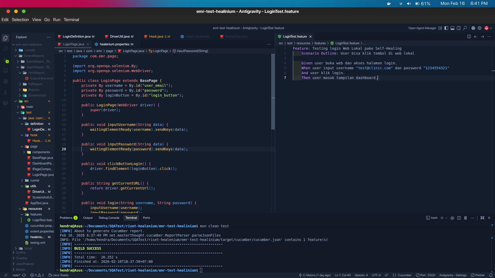
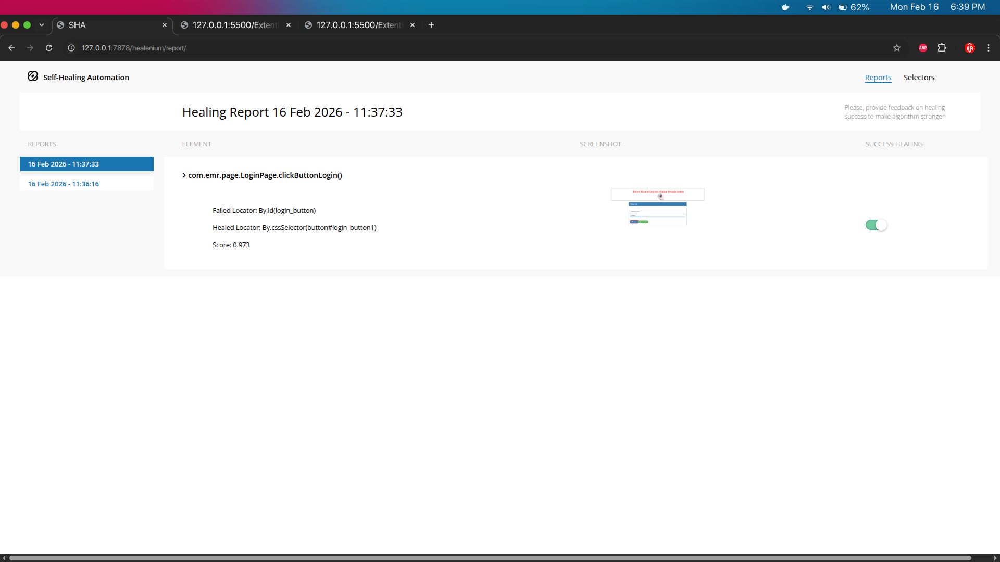

# EMR Test Healenium

Ini adalah proyek pengujian otomatis UI untuk sistem Electronic Medical Record (EMR) yang memanfaatkan beberapa teknologi modern untuk pengujian yang efisien dan Andal.

## Tentang Proyek Ini

Proyek ini adalah kerangka kerja pengujian otomatis UI yang dikembangkan dengan Java dan Maven. Ini menggunakan Selenium WebDriver untuk interaksi browser, Cucumber untuk pengembangan berbasis perilaku (BDD) yang memungkinkan penulisan skenario pengujian yang mudah dibaca, dan Healenium untuk kemampuan *self-healing* elemen. Kemampuan *self-healing* Healenium sangat penting untuk mengurangi kegagalan pengujian akibat perubahan kecil pada locator elemen UI. Fokus utamanya adalah pengujian otomatis, khususnya fungsionalitas login, untuk sistem EMR. Proyek ini juga mengintegrasikan Extent Reports untuk pelaporan hasil pengujian yang komprehensif.

## Struktur Proyek

```
.
├── .git/
├── .gitignore
├── .vscode/
├── Dokumentasi/
│   ├── Demo Healenium Selenium.mp4
│   ├── Report Healing.png
│   ├── Report Selectors.png
│   └── Script testing.png
├── ExtentReports/
├── pom.xml
├── docker-compose.yaml
├── src/
│   ├── main/
│   │   └── java/
│   │       └── com/
│   │           └── emr/
│   │               └── App.java
│   └── test/
│       ├── java/
│       │   └── com/
│       │       └── emr/
│       │           ├── AppTest.java
│       │           ├── definition/
│   	│           │   └── LoginDefinition.java
│       │           ├── hook/
│       │           │   └── Hook.java
│       │           ├── page/
│       │           │   ├── BasePage.java
│       │           │   ├── DashboardPage.java
│       │           │   ├── IPageComponent.java
│       │           │   ├── LoginPage.java
│       │           │   └── components/
│       │           │       ├── BaseComponent.java
│       │           │       └── SidebarComponent.java
│       │           ├── runner/
│       │           │   └── RunnerTest.java
│       │           └── utils/
│       │               ├── DriverUtil.java
│       │               └── ScreenshotUtil.java
│       └── resources/
│           ├── cucumber.properties
│           ├── extent.properties
│           ├── healenium.properties
│           ├── testng.xml
│           └── features/
│               └── LoginTest.feature
└── target/
```

## Tech Stack

Berikut adalah *tech stack* utama yang digunakan dalam proyek ini:

*   **Bahasa Pemrograman:** Java
*   **Build Tool:** Apache Maven
*   **Framework Pengujian:**
    *   Selenium WebDriver (untuk otomatisasi browser)
    *   Cucumber (untuk Behavior-Driven Development - BDD)
    *   TestNG (untuk menjalankan dan mengatur pengujian)
    *   Healenium (untuk kemampuan *self-healing* locator)
*   **Pelaporan:** Extent Reports
*   **Containerisasi:** Docker (berdasarkan `docker-compose.yaml`)
*   **Pola Desain Pengujian:** Page Object Model (POM)

## Dokumentasi

Dokumentasi detail terkait penggunaan, hasil pengujian, dan contoh implementasi dapat ditemukan di folder `Dokumentasi/`.

### Demonstrasi Video Healenium Selenium

[](Dokumentasi/Demo Healenium Selenium.mp4)
*Klik gambar untuk memutar video demonstrasi Healenium Selenium.*

### Laporan Healing


### Laporan Selector


### Script Testing


Untuk informasi lebih lanjut tentang konfigurasi dan menjalankan pengujian, silakan lihat file `pom.xml` untuk dependensi Maven dan properti konfigurasi di `src/test/resources/`.
